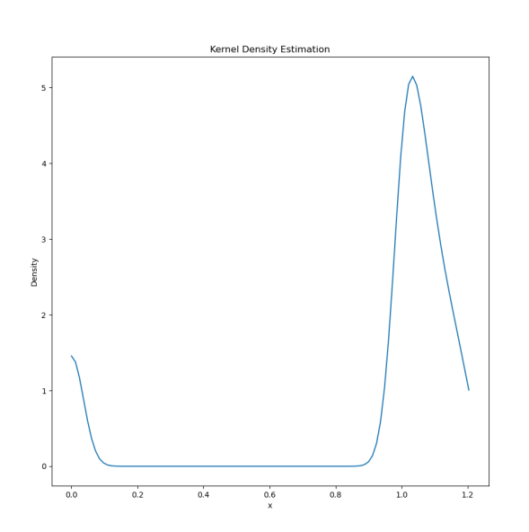

# scattering-simulator
A program in fortran that simulates the scattering of particles off of an energy barrier. then a python program that turns the output csv from the fortran one into a density graph.

To use modify the paremeters within scattering_simulation.f90 at the top of the file and run 

```bash
gfortran scattering_simulation.f90 -o scattering_simulation
./scattering_simulation
```

to generate a graph from the scatterplot.csv, you need have python with pip and do
```bash
pip install numpy matplotlib pandas scipy
```
you then need to run the python program like 
```bash
python graph.py
```

this will open a window showing the density graph


